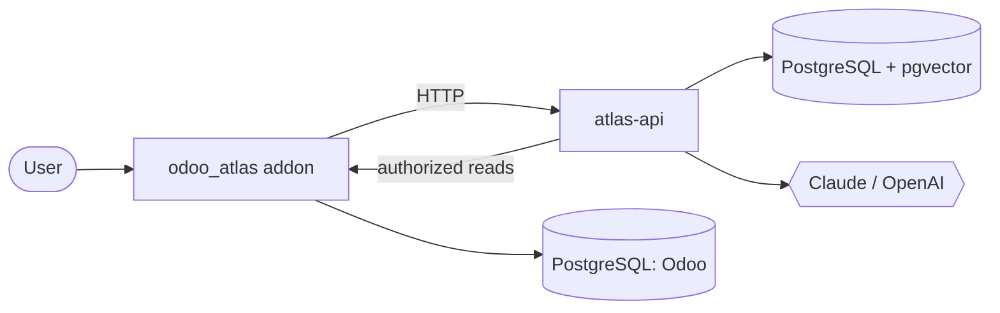

# Odoo Atlas

An AI assistant for Odoo Community Edition. It answers questions about data held in
Odoo in natural language, and it applies the same access rules the asking user
already has in the ERP.

[](https://github.com/Spideyman198/Atlas/actions/workflows/ci.yml)
[](LICENSE)

Status: early development. The architecture is documented, the development
environment runs, and the engine and addon foundations are in place. Nothing asks
a question end to end yet — see [ROADMAP.md](ROADMAP.md) for what has landed and
what is next.

## The problem

An Odoo instance holds everything a business knows about itself, and makes very
little of it askable. Answering "which customers haven't ordered in six months?"
means knowing which model to open, which filters to combine and which group-by to
apply. Most people don't, so they ask someone who does.

Adding a chatbot on the side does not fix this. A chatbot that reads the database
with an administrator connection ignores Odoo's record rules entirely, which makes
it a privilege escalation tool.

## What it does

| Question | How it is answered |
| --- | --- |
| Where is sales order SO00035? | Live ORM read through a typed tool call |
| Which invoices are overdue? | Live aggregation, not a stored embedding |
| Which products are low on stock? | `stock.quant` aggregation against reorder rules |
| Summarise this customer | Live facts plus semantic recall over notes |
| Which products generated the most revenue? | `read_group` over confirmed orders |
| What does our refund policy say? | Vector search over ingested PDFs and manuals |

## How it works

Three processes and one PostgreSQL cluster:



The addon is a thin adapter: models, views, security and the chat UI, with no AI
code in it. The engine holds retrieval and orchestration and never imports `odoo`;
it reaches the ERP over HTTP. Running the engine as a separate process keeps the AI
dependency tree away from Odoo's pinned one, and keeps 20-second model calls off
Odoo's synchronous worker pool ([ADR-0002](docs/adr/0002-sidecar-service-topology.md)).

### Access control

Retrieval runs in three stages. A vector and lexical search in pgvector produces
candidates, filtered by company and visibility. Those candidates are then sent back
to Odoo, which runs `search([('id','in',ids)])` as the asking user so its record
rules apply. Only the surviving rows are assembled into the prompt.

The second stage cannot be disabled by configuration. Removing the first stage would
make the system slower but no less safe, which is the property we want: correctness
does not depend on how fresh the index is. Baking permissions into the index at
ingestion time was rejected because it goes stale silently the moment a record rule,
a group membership or a company assignment changes
([ADR-0006](docs/adr/0006-data-access-and-authorization.md)).

Structured questions do not use retrieval at all. The model calls typed tools that
compile to validated Odoo domains and execute as the asking user. It never emits SQL
and never emits a raw domain.

### Retrieval

LlamaIndex provides node parsing, fusion retrieval and reranking. It is confined to
`atlas.infrastructure.llamaindex` and reached through ports the domain owns —
`DocumentLoader`, `EmbeddingProvider`, `VectorStore`, `Retriever`, `ChatProvider`.
Bridge adapters make LlamaIndex delegate back to our provider and persistence
layers, so there is one retry policy, one cost meter and one database schema rather
than two ([ADR-0003](docs/adr/0003-rag-framework-selection.md)).

Chat and embedding providers are separate ports because Anthropic ships no embedding
API. Claude for generation with OpenAI or Voyage for embeddings is a supported
configuration ([ADR-0005](docs/adr/0005-model-provider-strategy.md)).

## Requirements

- Docker Engine 24+ and Compose v2.20+
- About 6 GB of disk and 4 GB of RAM

No local Python, PostgreSQL or Odoo installation is needed. Lint, type-check and
test all run in a container.

## Quick start

```bash
git clone https://github.com/Spideyman198/Atlas.git
cd Atlas
make init
make up
```

On Windows, use `.\make.ps1 <target>` instead of `make <target>`.

First boot initialises the Odoo database and installs the addon, which takes a few
minutes. When it finishes:

- Odoo: <http://localhost:8069> (`admin` / `admin`), with **Atlas** in the menu
- Engine API docs: <http://127.0.0.1:8000/docs>

Check the engine can reach its database:

```bash
curl http://127.0.0.1:8000/readyz
```

```json
{"status": "ready", "checks": {"database": "ok", "pgvector": "ok (0.8.6)"}}
```

Full instructions and troubleshooting are in [docs/installation.md](docs/installation.md).

## Development

```bash
make check      # ruff, mypy --strict, import contracts, both test suites
make test       # engine tests with coverage
make test-odoo  # addon tests, on a database built from nothing
make logs       # follow all services
make help       # all targets
```

The addon is not tested by pytest. Odoo models only exist inside a loaded
registry, so its tests run under Odoo's own runner against a freshly installed
database.

Three architectural rules are enforced by `import-linter` in CI rather than by
review: `domain` imports nothing else from `atlas`, nothing in `atlas` imports
`odoo`, and nothing outside `atlas.infrastructure.llamaindex` imports `llama_index`.

## Layout

```
addons/odoo_atlas/    Odoo addon: models, views, security, chat UI
services/atlas/       Engine: domain / application / infrastructure / interfaces
evaluation/           Golden question set and retrieval metrics
docker/               Dockerfiles
docs/                 ADRs and architecture documentation
```

## Documentation

| | |
| --- | --- |
| [Architecture overview](docs/architecture/01-overview.md) | Components, layering, repository layout, known limits |
| [Data architecture](docs/architecture/02-data-architecture.md) | Schema, indexes, performance, migration policy |
| [Request lifecycle](docs/architecture/03-request-lifecycle.md) | Query, ingestion and failure paths |
| [Decision records](docs/adr/README.md) | Seven decisions with the alternatives that were rejected |
| [Installation](docs/installation.md) | Setup and troubleshooting |
| [Contributing](CONTRIBUTING.md) | Workflow, standards, commit conventions |
| [Roadmap](ROADMAP.md) | Planned work |
| [Changelog](CHANGELOG.md) | Released changes |

## Limits

- Designed for corpora up to roughly 10^6 chunks on a single PostgreSQL instance.
  Beyond that, partition `chunks` by company or move dense search to a dedicated
  engine.
- Read-only. The assistant answers questions; it does not create or modify records.
- Ingestion and prompts are tuned for English.
- Semantic answers reflect the last incremental sync. Structured answers are live.
- The vector index contains ERP content and must be protected like the Odoo database
  itself. Access control protects the assistant, not the database.

## License

LGPL-3.0-or-later. [`LICENSE`](LICENSE) holds the LGPL text and [`COPYING`](COPYING)
the GPL-3.0 text it incorporates by reference.

You may deploy and build on Atlas commercially, including alongside proprietary
code. Modifications to Atlas itself stay open if you distribute them. LGPL rather
than AGPL is deliberate — reasoning in [ADR-0007](docs/adr/0007-licensing.md).

Odoo is a trademark of Odoo S.A. This project is not affiliated with Odoo S.A.
