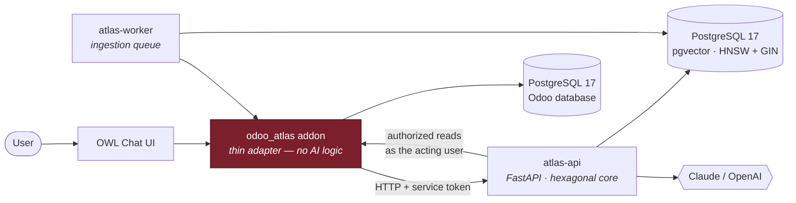

<div align="center">

# Odoo Atlas

**An AI-powered enterprise copilot for Odoo Community Edition.**

Ask your ERP questions in plain language. Get answers grounded in your own data,
with clickable citations — and never see a record you weren't already allowed to open.

[](LICENSE)
[](https://github.com/odoo/odoo)
[](https://www.python.org/)
[](https://github.com/pgvector/pgvector)
[](https://github.com/astral-sh/ruff)
[](https://mypy-lang.org/)

</div>

---

> [!NOTE]
> **Status: in active development.** Milestone **M0 — Planning & Architecture** is
> complete; the architecture and its rationale are fully documented and reviewable
> in [`docs/`](docs/). Implementation proceeds milestone by milestone — see
> [ROADMAP.md](ROADMAP.md) for what has landed and what is next. Screenshots and a
> demo recording arrive with M11/M14.

## The problem

An Odoo instance holds everything a business knows about itself — every customer,
order, invoice, stock move, and opportunity — and makes almost none of it
*askable*. Answering "which customers haven't ordered in six months?" means knowing
which model to open, which filters to combine, and which group-by to apply. Most
people don't, so they ask someone who does, and that person builds a pivot table.

Bolting a chatbot onto the side does not fix this. A chatbot that reads your
database with an admin connection is a data breach with a friendly interface.

## What Odoo Atlas does

An assistant that lives **inside** Odoo, answers from **your** data, and inherits
**your** permissions.

| Question | How Atlas answers it |
| --- | --- |
| *"Where is Sales Order SO00035?"* | Live ORM read via a typed tool call |
| *"Which invoices are overdue?"* | Live aggregation — never a stale embedding |
| *"Which products are low on stock?"* | `stock.quant` aggregation against reorder rules |
| *"Summarise this customer."* | Hybrid: live facts + semantic recall over notes |
| *"Which products generated the most revenue?"* | `read_group` over confirmed orders |
| *"What does our refund policy say?"* | Vector retrieval over ingested PDFs and manuals |

## What makes it different

**🔐 Authorization is not an afterthought — it is the architecture.**
Every retrieved record is re-checked against Odoo's own record rules, as the asking
user, on every request. Not baked into the index at ingestion time (which goes stale
and silently over-discloses), not approximated with metadata filters. Odoo decides;
Atlas obeys. The assistant is provably incapable of surfacing a record the user
could not open in the UI. → [ADR-0006](docs/adr/0006-data-access-and-authorization.md)

**🧮 It knows when *not* to use RAG.**
"Which invoices are overdue?" is arithmetic over live data, not a similarity search.
A router classifies intent and routes structured questions to typed, validated,
read-only tools that compile to Odoo ORM calls — **never** to generated SQL.
→ [ADR-0006](docs/adr/0006-data-access-and-authorization.md)

**🔌 No vendor lock-in, in either direction.**
Chat and embeddings are separate ports with separate adapters, because Anthropic
ships no embedding API and pretending otherwise produces a leaky abstraction.
Claude for reasoning + OpenAI or Voyage for embeddings is a supported, documented
configuration. → [ADR-0005](docs/adr/0005-model-provider-strategy.md)

**🧩 LlamaIndex, contained.**
The retrieval framework lives entirely in one infrastructure package, behind ports
the domain owns — `Retriever`, `VectorStore`, `EmbeddingProvider`, `DocumentLoader`,
`ChatProvider`. It calls *back* into our provider layer through bridge adapters, so
there is one retry policy and one cost meter, not two. `import-linter` fails the
build if `llama_index` appears anywhere else. Replacing it would touch one directory.
→ [ADR-0003](docs/adr/0003-rag-framework-selection.md)

**🧱 One stateful service.**
pgvector in the PostgreSQL you already run for Odoo. No Pinecone account, no Qdrant
container, no ERP data leaving your infrastructure.
→ [ADR-0004](docs/adr/0004-vector-store-and-index-strategy.md)

**📐 Hexagonal, and enforced by CI.**
`domain` has zero I/O. `application` depends only on ports. The engine never imports
`odoo` — checked by `import-linter`, not by good intentions. Which is what makes the
whole test suite runnable offline with no API key.
→ [Architecture Overview](docs/architecture/01-overview.md)

**📊 Retrieval quality is measured, not asserted.**
A golden question set with recall@k, MRR, nDCG, and a faithfulness judge. Claims in
this README come with numbers attached. → M12

## Architecture at a glance



The AI engine runs **beside** Odoo, not inside it — Odoo's synchronous pre-forked
workers must never block on a 20-second LLM call, and the AI dependency tree must
never collide with Odoo's pinned one.
→ [ADR-0002](docs/adr/0002-sidecar-service-topology.md)

## Documentation

| | |
| --- | --- |
| **[Architecture Overview](docs/architecture/01-overview.md)** | C4 diagrams, layering, repository layout, SOLID mapping, known limits |
| **[Data Architecture](docs/architecture/02-data-architecture.md)** | ER diagrams, DDL, indexing strategy, performance design, migration policy |
| **[Request Lifecycle](docs/architecture/03-request-lifecycle.md)** | Sequence diagrams for query, ingestion, and failure paths |
| **[Architecture Decision Records](docs/adr/README.md)** | Seven decisions, each with the alternatives we rejected and why |
| **[Roadmap](ROADMAP.md)** | Sixteen milestones, with acceptance criteria |
| **[Contributing](CONTRIBUTING.md)** | Workflow, standards, commit conventions |
| **[Changelog](CHANGELOG.md)** | Keep a Changelog / SemVer |

Installation, developer, API, and deployment guides land with the milestones that
make them true (M1, M2, M6, M14 respectively).

## Tech stack

| Layer | Choice | Rationale |
| --- | --- | --- |
| ERP | Odoo 19 CE | Target platform; LGPL-3 |
| Addon | Odoo ORM, XML views, OWL 2 | Native UX, native security |
| Engine | Python 3.12, FastAPI, `asyncio` | Async I/O for concurrent LLM calls |
| Persistence | PostgreSQL 17, pgvector 0.8, SQLAlchemy 2.0 Core, Alembic | One stateful service; explicit SQL; reviewed migrations |
| Retrieval | **LlamaIndex** (`llama-index-core`) — node parsing, fusion retrieval, reranking | Mature algorithms, confined to one infrastructure package → [ADR-0003](docs/adr/0003-rag-framework-selection.md) |
| Search | HNSW + `tsvector` GIN, Reciprocal Rank Fusion, MMR | Hybrid beats dense-only on ERP text |
| Models | Anthropic + OpenAI + Voyage, behind ports | Deployment flexibility, no lock-in |
| Orchestration | Clean/Hexagonal architecture with owned ports | Authorization and observability stay outside the framework |
| Quality | pytest, ruff, mypy `--strict`, import-linter, pre-commit | Enforced, not aspirational |
| Delivery | Docker Compose, GitHub Actions, Trivy, pip-audit, gitleaks | Reproducible, scanned |

## Quick start

> Available from **M1**. It will be:
>
> ```bash
> cp .env.example .env && make up
> ```
>
> …bringing up Odoo, PostgreSQL + pgvector, and the Atlas engine, with a seeded demo
> database, in one command.

## Project layout

```
addons/odoo_atlas/    Odoo addon — models, views, security, OWL UI. Thin.
services/atlas/       The engine — domain / application / infrastructure / interfaces
evaluation/           Golden question set and retrieval metrics harness
docker/               Dockerfiles
docs/                 ADRs and architecture documentation
```

## Contributing

Contributions welcome — read [CONTRIBUTING.md](CONTRIBUTING.md) first. Every
architecturally significant change needs an ADR; that is the one rule we do not bend.

## License

**LGPL-3.0-or-later.** [`LICENSE`](LICENSE) holds the LGPL text and
[`COPYING`](COPYING) the GPL-3.0 text it incorporates by reference.

In practice: you may deploy Atlas commercially and build on it, including alongside
proprietary code. If you modify Atlas itself and distribute it, those modifications
stay open. LGPL rather than AGPL is a deliberate choice to keep Atlas deployable
inside corporate infrastructure — reasoning in
[ADR-0007](docs/adr/0007-licensing.md).

Odoo is a trademark of Odoo S.A. This project is not affiliated with or endorsed by
Odoo S.A.
