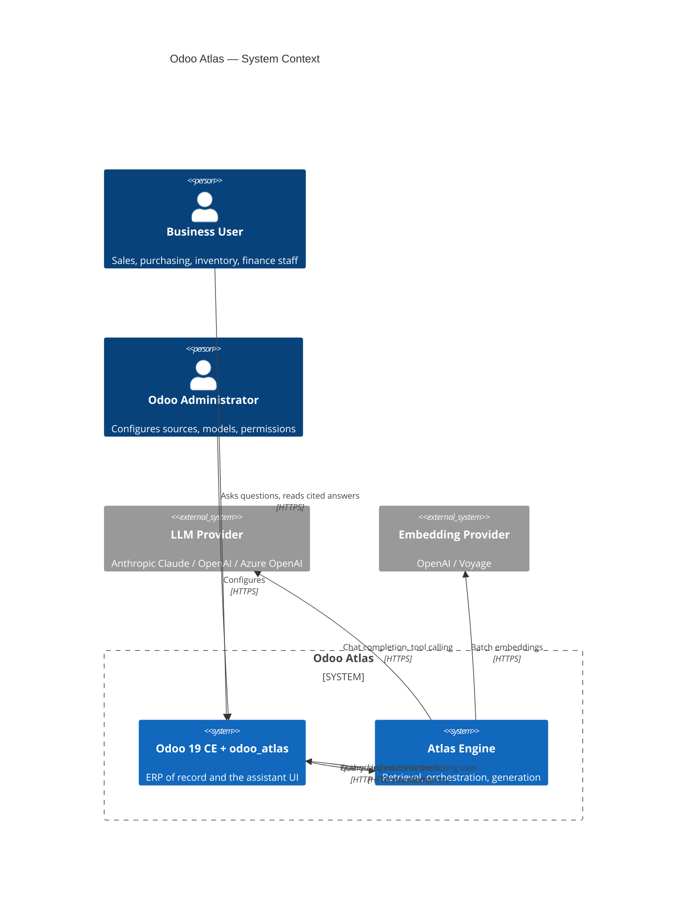
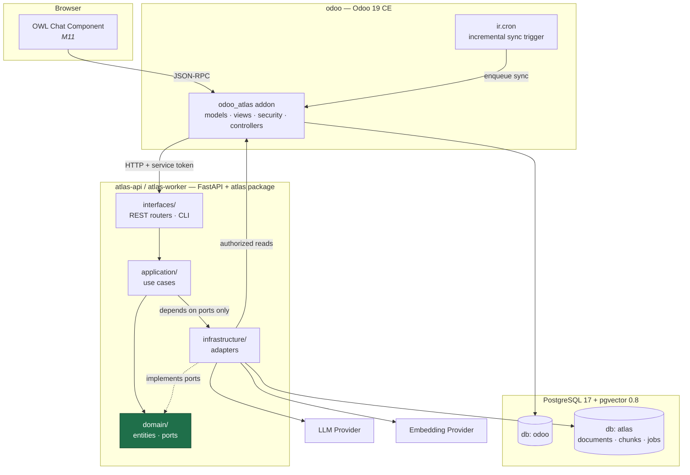

# Architecture Overview

> Read [`docs/adr/`](../adr/README.md) for *why*. This document describes *what*.

## 1. System context

Who talks to Atlas, and what Atlas talks to.



Two things to notice, because they are the design:

1. **The arrow from Atlas Engine back into Odoo.** The engine has no direct read
   path to ERP data. Everything goes through Odoo, as the acting user
   ([ADR-0006](../adr/0006-data-access-and-authorization.md)).
2. **The user only ever touches Odoo.** The engine is never publicly exposed.

## 2. Container view



The dashed arrow is the **Dependency Inversion Principle** drawn literally:
`application` depends on the abstractions in `domain`, and `infrastructure` supplies
implementations.

Three rules make that diagram true, and all three are enforced in CI by
`import-linter` contracts (M2) rather than by convention:

1. `domain` imports nothing else from `atlas`, and performs no I/O.
2. Nothing anywhere in `atlas` imports `odoo` — the engine reaches Odoo only over
   HTTP ([ADR-0002](../adr/0002-sidecar-service-topology.md)).
3. Nothing outside `atlas.infrastructure.llamaindex` imports `llama_index` — the
   retrieval framework is a swappable detail ([ADR-0003](../adr/0003-rag-framework-selection.md)).

## 3. Target repository layout

Directories marked *(Mx)* arrive at that milestone. M0 creates only what is listed
under "already present".

```
odoo-atlas/
├── .github/workflows/            # (M1) lint, type, test, security, release
├── addons/
│   └── odoo_atlas/               # (M5) the Odoo addon — a thin adapter
│       ├── __manifest__.py
│       ├── models/               #   atlas.conversation, atlas.message, settings
│       ├── controllers/          # (M6) REST endpoints the engine calls back into
│       ├── services/             #   HTTP client for atlas-api
│       ├── wizards/              # (M7) ingest-source configuration wizard
│       ├── views/                #   XML: forms, lists, menus, actions, settings
│       ├── security/             #   groups, ir.model.access.csv, record rules
│       ├── data/                 #   ir.cron, suggested prompts
│       ├── static/src/           # (M11) OWL components, SCSS, XML templates
│       └── tests/                #   Odoo TransactionCase / HttpCase
├── services/
│   └── atlas/                    # (M2) the engine — framework-agnostic library
│       ├── pyproject.toml
│       ├── src/atlas/
│       │   ├── domain/           #   entities, value objects, ports. Zero I/O.
│       │   ├── application/      #   use cases. Orchestration only.
│       │   ├── infrastructure/   #   adapters
│       │   │   ├── llamaindex/   #     ONLY package that may import llama_index
│       │   │   ├── persistence/  #     PgVectorStore — our schema, SQLAlchemy Core
│       │   │   ├── providers/    #     Anthropic / OpenAI / Voyage SDK adapters
│       │   │   └── odoo/         #     OdooGateway HTTP adapter
│       │   ├── interfaces/       #   FastAPI routers, CLI entrypoints
│       │   ├── config/           #   typed settings, composition root
│       │   └── prompts/          #   versioned Jinja2 templates
│       ├── migrations/           # (M4) Alembic
│       └── tests/{unit,integration,contract}
├── evaluation/                   # (M12) golden question set + metrics harness
├── docker/                       # (M1) Dockerfiles per image
├── docs/
│   ├── adr/                      # ✅ already present
│   ├── architecture/             # ✅ already present
│   ├── assets/                   # (M14) diagrams, screenshots, GIFs
│   ├── installation.md           # (M1)
│   ├── developer-guide.md        # (M2)
│   ├── api.md                    # (M6)
│   └── deployment.md             # (M14)
├── scripts/                      # (M1) bootstrap, seed, reindex helpers
├── docker-compose.yml            # (M1)
├── Makefile                      # (M1)
├── pyproject.toml                # (M1) workspace-level tooling config
├── README.md                     # ✅
├── ROADMAP.md                    # ✅
├── CHANGELOG.md                  # ✅
├── CONTRIBUTING.md               # ✅
├── LICENSE / COPYING             # ✅
├── .gitignore / .gitattributes / .editorconfig   # ✅
```

## 4. The layers, and what belongs in each

| Layer | May import | Must never import | Contains |
| --- | --- | --- | --- |
| `domain` | stdlib, `pydantic` | anything else in `atlas` | `Document`, `Chunk`, `Citation`, `Conversation`, `RetrievalResult`, `ChatRequest`; the `Protocol` definitions for every port |
| `application` | `domain` | `infrastructure`, `interfaces`, any SDK | Use cases: `AnswerQuestion`, `IngestSource`, `SyncCorpus`, `EvaluateRetrieval`. Pure orchestration, no I/O primitives |
| `infrastructure` | `domain`, SDKs, drivers, LlamaIndex | `application`, `interfaces` | `PgVectorStore`, `AnthropicChatProvider`, `OpenAIEmbeddingProvider`, `OdooHttpGateway`, retry/metrics decorators, and `infrastructure/llamaindex/` — the **only** package permitted to import `llama_index` ([ADR-0003](../adr/0003-rag-framework-selection.md)) |
| `interfaces` | `application`, `domain`, `config` | `infrastructure` directly | FastAPI routers, request/response schemas, CLI commands |
| `config` | everything | — | Typed settings and the **composition root** — the one place adapters are wired to ports |

The composition root is deliberate: it is the *only* module allowed to know which
concrete adapter satisfies which port. Everything else receives its collaborators
by injection. That is what makes the fakes in M3 possible and the unit tests fast.

## 5. How this maps to SOLID

Not a checklist for its own sake — each principle is doing a specific job here.

- **Single Responsibility.** A `Chunker` chunks. A `Retriever` retrieves. An
  `AnswerQuestion` use case orchestrates them and does neither. When "add citation
  formatting" arrives, exactly one class changes.
- **Open/Closed.** Adding Voyage embeddings, a Gemini chat provider, or a Confluence
  loader means adding a class in `infrastructure` and one line in the composition
  root. No existing file is edited.
- **Liskov Substitution.** Every adapter for a port passes the same
  **contract test suite** (M3). `FakeChatProvider` and `AnthropicChatProvider` are
  interchangeable by construction, which is what lets the whole test suite run
  offline.
- **Interface Segregation.** `ChatProvider` and `EmbeddingProvider` are separate
  ports precisely because Anthropic implements one and not the other
  ([ADR-0005](../adr/0005-model-provider-strategy.md)). A single fat `AIProvider`
  would force every adapter to raise `NotImplementedError` — the classic smell.
- **Dependency Inversion.** Drawn in the container diagram above.

## 6. Cross-cutting concerns

Each is implemented **once**, at a boundary, never sprinkled through use cases.

| Concern | Where it lives | Milestone |
| --- | --- | --- |
| Retry, backoff, timeout, circuit breaking | Decorator over any provider port | M3 |
| Token & cost accounting | Same decorator stack | M3 |
| Structured logging with correlation id | Middleware + `contextvars` | M2 |
| Tracing (OpenTelemetry) and metrics | Middleware + port decorators | M12 |
| Authorization post-filter | A pipeline stage in `application`, not optional | M6 |
| Audit logging | Odoo-side model, written by the callback controller | M6 |
| Rate limiting per user | FastAPI dependency | M13 |
| PII redaction | A `Redactor` applied before context enters a prompt | M13 |

## 7. Known limits at 1.0

Stated up front, because a README that claims no limits is not credible.

- **Corpus scale.** Designed and benchmarked for ~10⁵–10⁶ chunks on a single
  PostgreSQL instance. Beyond that, partition `chunks` by company or move dense
  search to a dedicated engine.
- **Read-only.** The assistant answers; it does not create or modify Odoo records.
  Write tools with human-in-the-loop confirmation are post-1.0.
- **Language.** Ingestion and prompts are tuned for English. Multilingual embeddings
  are a config change (`bge-m3`, `voyage-multilingual`); prompt localisation is not
  done.
- **Index sensitivity.** `atlas.chunks` contains ERP content and must be protected
  like the Odoo database itself. Authorization protects the *assistant*, not the
  database ([ADR-0006](../adr/0006-data-access-and-authorization.md), Consequences).
- **Freshness.** Semantic answers reflect the last incremental sync (default: 15
  minutes). Structured answers via tool calling are always live.
