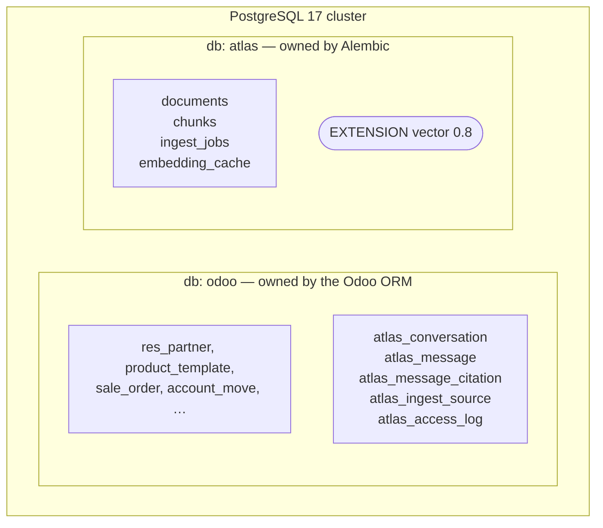
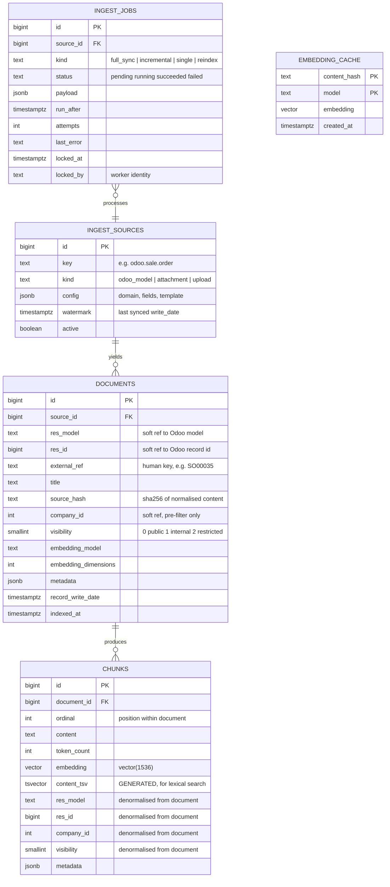
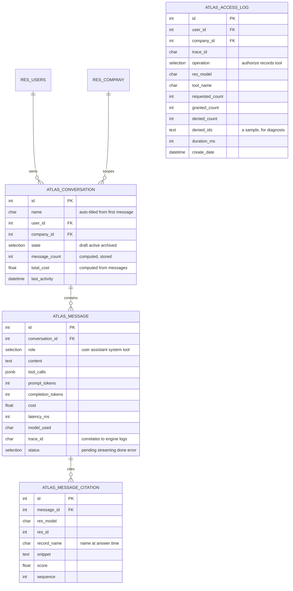

# Data Architecture

> Both halves are built as of M5. The authoritative definitions are the Alembic
> migrations under `services/atlas/migrations/` and the model classes under
> `addons/odoo_atlas/models/`; the diagrams below are the map, not the territory.

## 1. Two databases, one cluster



**Why the split** is argued in [ADR-0004](../adr/0004-vector-store-and-index-strategy.md).
The short version: embeddings are *derived* data with a different lifecycle, a
different owner, and a different backup policy from the ERP's system of record.

**What goes where, and the rule that decides it:**

> If a user needs to *see* it in Odoo — with a view, a menu, an access right, a
> record rule, or a chatter — it belongs in the **odoo** database as an ORM model.
> If it is machine-generated derived data serving the retrieval pipeline, it belongs
> in **atlas**.

That is why conversations live in Odoo (they need views, security groups, and record
rules so a user sees only their own threads) while chunks live in Atlas (nobody
browses a chunk table).

**Cost of the split:** no foreign keys across the boundary. `chunks.res_model` /
`chunks.res_id` is a *soft* reference, exactly like Odoo's own `ir.attachment`.
Referential integrity is maintained by the ingestion pipeline's delete-and-replace
semantics, and dangling chunks are harmless because stage-2 authorization
([ADR-0006](../adr/0006-data-access-and-authorization.md)) drops any chunk whose
record no longer resolves.

## 2. Entity–relationship model

### 2.1 Atlas database



Notes on the design:

- **`documents` vs `chunks` is a real distinction, not bookkeeping.** A document is
  the unit of *ingestion and invalidation* (one sales order, one PDF). A chunk is the
  unit of *retrieval*. Re-ingesting a document deletes and replaces its chunks
  atomically, which is what makes incremental sync correct.
- **Denormalising `company_id`, `visibility`, `res_model`, `res_id` onto `chunks`**
  is deliberate. The retrieval pre-filter must be evaluable in a single index scan
  on `chunks`; a join to `documents` would defeat the HNSW filtered-scan path. The
  cost is a write-time consistency obligation, satisfied because chunks are only
  ever written by the ingestion pipeline as part of a document replacement.
- **`source_hash`** is a SHA-256 of the normalised rendered content. If it is
  unchanged, ingestion skips the document entirely — no embedding call, no cost.
  This is what makes a 15-minute cron cheap.
- **`embedding_cache`** keyed by `(content_hash, model)` prevents re-paying for
  identical text across documents (boilerplate terms, repeated product descriptions)
  and makes re-index runs after a crash nearly free.
- **`embedding_model` / `embedding_dimensions` on `documents`** exist so the system
  can *detect* a model change rather than silently mixing incompatible vector spaces
  — the failure mode described in [ADR-0005](../adr/0005-model-provider-strategy.md).
- **`content_tsv` is a generated column**, so lexical and dense search always describe
  the same text. It cannot drift.
- **`visibility` as a smallint tier**, not a boolean: `0 = public` (product
  descriptions, published docs), `1 = internal` (most ERP records), `2 = restricted`
  (HR, finance). It is a coarse pre-filter, never the authority.

### 2.2 Odoo database — addon models



**Why citations are a model, not a JSON blob on the message.** They need to be
clickable — a citation resolves to `res_model` + `res_id`, and the UI renders a link
that opens the actual Odoo record. Making them rows gives us `search`, `read_group`
("which records are cited most?"), and a clean many2one-style resolution without
parsing JSON in the view layer. It also lets M12 measure citation coverage with SQL.

The reference is resolved at read time rather than stored as a `many2one`, because
there is no foreign key to hang one on: the cited record may be deleted after the
answer was given. `record_name` keeps the name the record had when it was cited, so a
citation still reads sensibly once its target is gone.

**Why `atlas_access_log` is separate from `atlas_message`.** One message may trigger
several authorization checks across several models, and the log must survive message
deletion for audit purposes. It is append-only through the ORM — no group has write
access — and each row is written *as the acting user*, taking the user and company
from the environment rather than from the request, so a caller cannot attribute its
own access to somebody else. Failing to write a row fails the request that caused it:
an access nobody could audit is what the log exists to make impossible.

**`user_id` and `company_id` are repeated on messages and citations.** They are copied
from the conversation and stored, so that every record rule in the addon is a
comparison against an indexed column rather than a join back to `atlas_conversation`.
This is the same trade made on `chunks` above, for the same reason, with the same
write-time consistency obligation — here discharged by the ORM, since both are related
fields the framework recomputes.

**A conversation cannot change owner.** Its answers were computed under one user's
access rights ([ADR-0006](../adr/0006-data-access-and-authorization.md)); reassigning
it would show a second user results assembled from records they may not read. The
record rules prevent reading someone else's conversation, and
`atlas.conversation.write` prevents pushing one of your own onto them.

## 3. Indexing strategy

```sql
-- Dense retrieval. HNSW: incremental builds, no training step, best recall/latency.
-- See ADR-0004 for why not IVFFlat.
-- m = 16, ef_construction = 64 chosen by measurement, not by default:
-- m = 32 costs 3x the build time and is slower at query time for no recall
-- advantage; ef_construction = 128 doubles build time for a gain that
-- ef_search buys more cheaply — and ef_search needs no rebuild.
CREATE INDEX chunks_embedding_hnsw_idx
    ON chunks USING hnsw (embedding vector_cosine_ops)
    WITH (m = 16, ef_construction = 64);

-- Lexical retrieval, fused with the dense results via RRF at query time.
CREATE INDEX chunks_tsv_gin_idx ON chunks USING gin (content_tsv);

-- Pre-filter selectivity. Column order matters: company_id is the high-cardinality
-- discriminator in multi-company deployments and is always present in the predicate.
CREATE INDEX chunks_scope_idx ON chunks (company_id, visibility);

-- Delete-and-replace on record update, and citation resolution.
CREATE INDEX chunks_record_idx ON chunks (res_model, res_id);

-- Idempotent ingestion: unchanged content is skipped before any API call.
CREATE UNIQUE INDEX documents_source_hash_key ON documents (source_hash);

-- Incremental sync watermark scans.
CREATE INDEX documents_source_written_idx ON documents (source_id, record_write_date);

-- Queue polling with SELECT ... FOR UPDATE SKIP LOCKED (M7).
CREATE INDEX ingest_jobs_claim_idx ON ingest_jobs (status, run_after)
    WHERE status IN ('pending', 'running');
```

### Query-time parameters

| Parameter | Value | Why |
| --- | --- | --- |
| `hnsw.ef_search` | `40` | Measured: p50 2.0 ms at 50k chunks. Raising it to 200 roughly doubles p50 for a recall gain worth having only if production recall proves short ([performance.md](../performance.md)). |
| `hnsw.iterative_scan` | `relaxed_order` | Keeps scanning until enough rows survive the `WHERE` filter. Without it a filtered search returned 5.1 rows for a `LIMIT` of 8. |
| `enable_bitmapscan`, `enable_seqscan` | `off`, dense search only | Measured: without them the planner takes a bitmap scan over `(company_id, visibility)` and sorts 16,666 rows — 126.95 ms instead of 3.94 ms. `SET LOCAL`, because the lexical search needs a bitmap scan. |
| `maintenance_work_mem` | ≥ 1 GB during index build | HNSW builds in memory or spills catastrophically. |
| `shm_size` on the container | ≥ 2 GB | A parallel HNSW build asks for ~1 GB of shared memory. Docker's 64 MB default fails with "No space left on device", which is not a disk problem. |
| Over-fetch factor | `k * 4` | Headroom for the authorization post-filter's denial rate. |

## 4. Performance design

Ordered by impact, which is roughly the reverse of the order people usually attack.

1. **Don't embed what hasn't changed.** `source_hash` + `embedding_cache` turn a
   full re-sync into a cheap no-op. This dominates ingestion cost.
2. **Batch embeddings.** One API call per ~96 chunks rather than per chunk. Cuts
   ingestion wall-clock by roughly an order of magnitude.
3. **`COPY` for bulk chunk inserts** during initial ingestion; `INSERT` for
   incremental updates.
4. **Build the HNSW index once, then insert incrementally.** Never drop and rebuild
   during normal operation.
5. **Batch the authorization post-filter** — one `search` per *model*, not per
   record id. Turns 40 round-trips into 3.
6. **Pool connections** (`psycopg_pool`) in the engine; Odoo manages its own pool.
7. **Cap the context budget in tokens, not chunk count.** Prompt cost is the largest
   per-query expense.
8. **`EXPLAIN (ANALYZE, BUFFERS)` in the benchmark suite**, so performance claims
   come with numbers. `make bench` produces them; the harness is in
   [benchmarks/](../../benchmarks/README.md) and the results, with what they do
   and do not establish, in [performance.md](../performance.md).

**No query cache.** Retrieval measured ~4 ms p50 against a request dominated by
seconds of model call. Adding a cache in front of it would buy 0.1% and cost an
invalidation problem. The cache that pays for itself is the embedding cache
above, which already exists. This is a decision the numbers made — before
measuring, a retrieval cache looked like an obvious win.

## 5. Migration policy

- **Atlas DB:** Alembic. Every schema change is a reviewed migration with a working
  `downgrade`. Migrations run on container start via an init job, never implicitly
  from application code.
- **Odoo DB:** the standard Odoo module upgrade path (`-u odoo_atlas`), with
  `migrations/<version>/` scripts when a data migration is required.
- **Embedding dimension changes** are a re-index, not a migration. M7 ships an
  explicit `atlas reindex` command; the service refuses to start if the configured
  model disagrees with the corpus.
- **Backups:** the `odoo` database is the system of record and must be backed up.
  The `atlas` database is derived and *may* be backed up for restore speed — it can
  always be rebuilt from Odoo plus the source documents.
