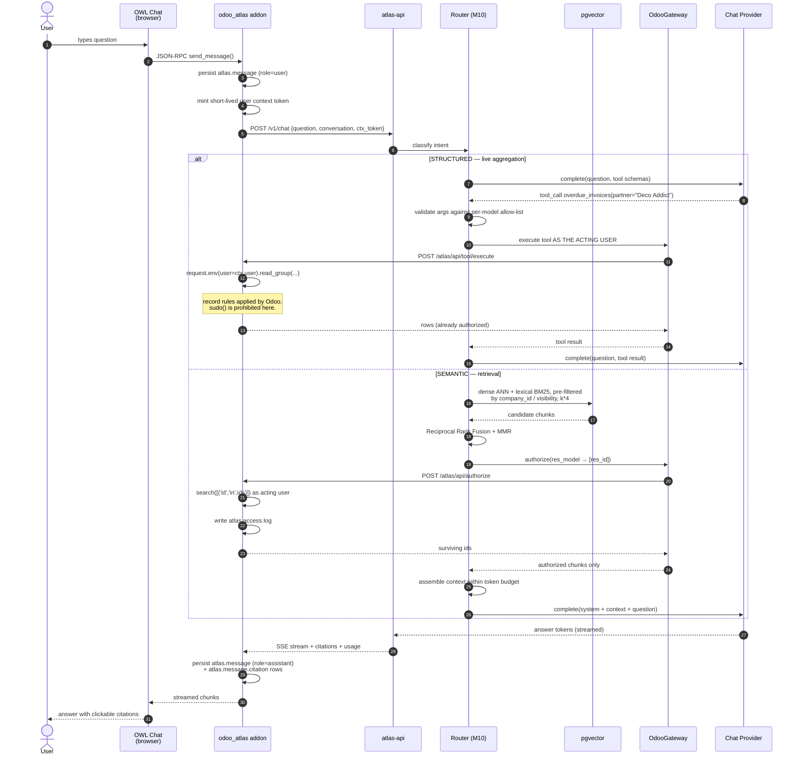
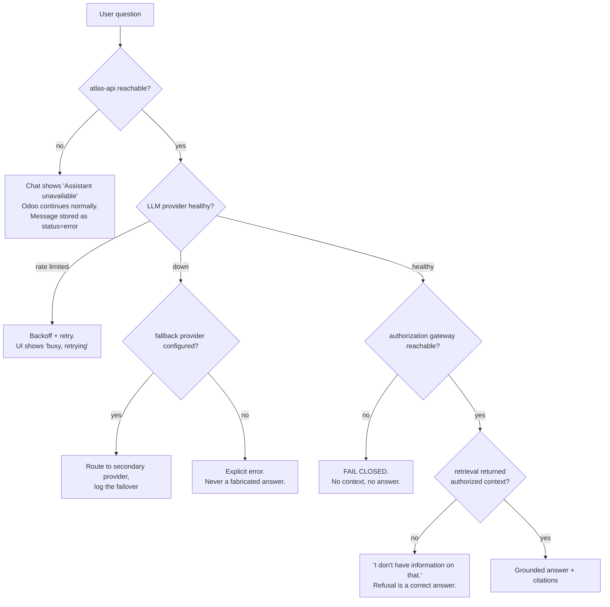

# Request Lifecycle

Three flows define the system. Everything else is detail.

---

## 1. Answering a question (the hot path)

The user asks *"Which invoices are overdue for Deco Addict?"*.



### What to notice

- **Step order is the security model.** The authorization call sits *between*
  retrieval and prompt assembly. There is no path from `pgvector` to `LLM` that
  skips it. If `OdooGateway` fails, the request fails closed — it does not fall
  back to unfiltered context.
- **The router picks live data over embeddings when correctness demands it.** An
  overdue-invoice question answered from a vector index would be answered from a
  snapshot, and confidently wrong. Semantic retrieval is for prose (policies,
  manuals, notes), not for arithmetic.
- **`HYBRID` intent exists too** ("summarise this customer"): the router runs the
  structured branch for facts and the semantic branch for context, then merges. Both
  branches keep their own authorization step.
- **Citations are produced by the pipeline, not by the model.** They are attached
  from the chunks that actually entered the prompt, so a citation can never be
  hallucinated. Retrieval algorithms come from LlamaIndex, but prompt assembly and
  citation construction stay in `application`, which is what makes this guarantee
  hold ([ADR-0003](../adr/0003-rag-framework-selection.md)).
- **`trace_id` is minted at step 5** and threaded through every log line, the
  `atlas.message` row, and the access log. One id ties a user complaint to the exact
  prompt, the exact chunks, and the exact cost.

### Latency budget (target, verified in M13)

| Stage | Budget |
| --- | --- |
| Odoo → engine hop | ~2 ms |
| Intent classification | 150–400 ms (small model) |
| Hybrid retrieval | 20–60 ms |
| Authorization post-filter | 20–60 ms |
| LLM generation (first token) | 300–900 ms |
| **Time to first token** | **< 1.5 s** |

---

## 2. Incremental ingestion (the cold path)

Runs on `ir.cron`, default every 15 minutes.

```mermaid
sequenceDiagram
    autonumber
    participant CR as ir.cron
    participant AD as odoo_atlas addon
    participant API as atlas-api
    participant JQ as ingest_jobs
    participant W as atlas-worker
    participant OG as OdooGateway
    participant EMB as Embedding Provider
    participant DB as atlas DB

    CR->>AD: trigger sync
    AD->>API: POST /v1/ingest/sync {sources}
    API->>JQ: INSERT job (kind=incremental)
    API-->>AD: 202 Accepted {job_id}

    loop worker poll
        W->>JQ: SELECT ... FOR UPDATE SKIP LOCKED LIMIT 1
        JQ-->>W: claimed job
        W->>OG: fetch records WHERE write_date > watermark
        Note over OG,AD: read as a dedicated integration user<br/>with an explicit, least-privilege role
        OG-->>W: record batch
        loop per record
            W->>W: render to text via source template
            W->>W: sha256 → source_hash
            alt hash unchanged
                W->>W: skip (no embedding cost)
            else new or changed
                W->>W: chunk (structural + token-aware overlap)
                W->>DB: lookup embedding_cache
                W->>EMB: embed uncached batch (≤96)
                EMB-->>W: vectors
                W->>DB: BEGIN; DELETE old chunks;<br/>UPSERT document; COPY chunks; COMMIT
            end
        end
        W->>JQ: advance watermark; status=succeeded
    end
```

### What to notice

- **`FOR UPDATE SKIP LOCKED`** gives a durable, transactional job queue with no
  Redis, no Celery, and no extra container. Multiple workers can drain the same
  queue safely. It is the single best argument for already having PostgreSQL.
- **The hash check happens before the embedding call**, not after. That ordering is
  the difference between a cron job that costs cents per day and one that costs
  dollars per hour.
- **Delete-and-replace inside one transaction** means a record's chunks are never
  half-updated. A reader either sees the old set or the new set.
- **Ingestion uses a dedicated integration user**, not the end user — it must see
  everything it is configured to index. This is precisely why query-time
  authorization ([ADR-0006](../adr/0006-data-access-and-authorization.md)) cannot be
  skipped: the index is deliberately broader than any single user's view.
- **Failures are retried with backoff** via `attempts` and `run_after`; poisoned jobs
  land in a dead-letter state and surface on the Odoo settings page rather than
  failing silently.

---

## 3. Failure and degradation

An enterprise product is judged on what it does when things break.



Three rules encoded here:

1. **Fail closed on authorization.** An unreachable gateway never degrades into
   unfiltered retrieval.
2. **Never fabricate.** No context and no tool result means the assistant says so.
   M12 measures this as a first-class metric, because a system that answers
   everything is worse than one that admits gaps.
3. **Never take Odoo down.** The addon's HTTP client has a hard timeout and a circuit
   breaker. An engine outage degrades the assistant, not the ERP.
